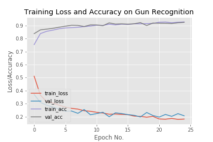

# Convolutional Neural Network for Gun Recognition

The code contains a basic CNN model *Gun Recognizer* using `keras` library.

I implemented a simple CNN network that achieves over *90%* accuracy.

Here's the plot of loss/accuracy data -:

The following layers are in the architecture of the Convolutional Network:
- Convolution layer
- ReLU (Rectified Linear Unit) activation 
- Pool layer
- Convolution layer
- ReLU (Rectified Linear Unit) activation 
- Pool layer
- Fully connected layer
- Softmax layer

## Setup:
- Download all the files.
- Install required python libraries => `keras` `sklearn` `OpenCV` `matplotlib` `numpy` `imutils`
- Set the path of input image `cv2.imread(imagepath)` in test_image.py

## Execute:
`python test_image.py`
